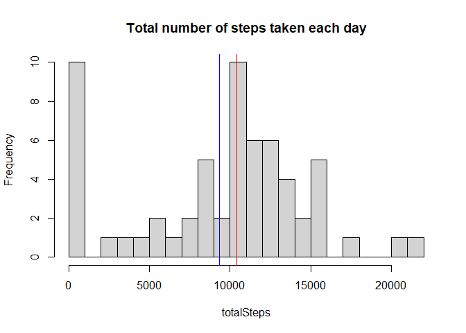
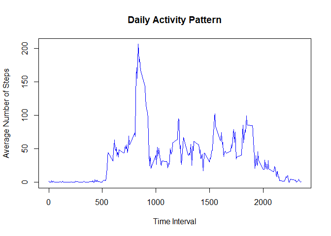
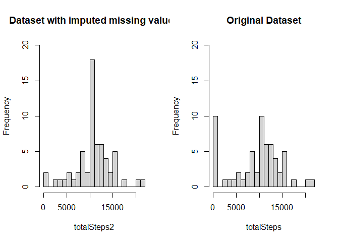
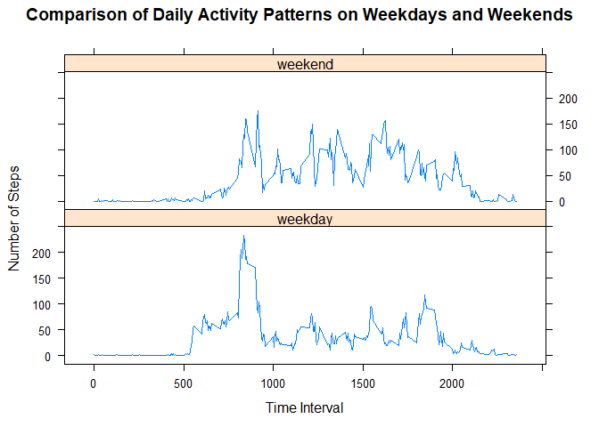

This report documents the steps taken to complete the first peer-assessed assignment in week 2 of the "Reproducible Research" course on Coursera by R. Peng from Johns Hopkins University. It consists of the following five subsections:

- Loading and preprocessing the data  
- What is the mean total number ov steps taken per day?  
- What is the average daily activity pattern?  
- Imputing missing values  
- Are there differences in activity patterns between weekdays and weekends?  

## Loading and preprocessing the data
First, the given activity data set has to be unzipped, loaded into R and preprocessed. 
We start by unzipping the given data set:

```r
unzip("activity.zip")
```
Then read the dataset into a variable called *activityData*:

```r
activityData <- read.csv("activity.csv", header = TRUE)
```
The entries in the date variable are stored as character values in YYYY-MM-DD format and therefore need to be transformed into a more easily to process date format. 

```r
activityData$date <- as.Date(activityData$date, format = "%Y-%m-%d")
```
The interval values come as integers in the format 5, 10, 15, 20, ... 100, 105, 110, ... 2355 and have to be transformed into a more easily to process time format.

```r
activityData$interval <- sprintf("%04d", activityData$interval)
activityData$interval <- format(strptime(activityData$interval,"%H%M"), format="%H:%M")    
```
Finally, we store a joint value of date and interval in date format in a separate column called *timeInterval*:

```r
activityData$timeInterval <- paste(activityData$date, activityData$interval, sep = " ")
activityData$timeInterval <- strptime(activityData$timeInterval, "%Y-%m-%d %H:%M")
```
This is what the data set looks like:

```r
head(activityData)
```

```
##   steps       date interval        timeInterval
## 1    NA 2012-10-01    00:00 2012-10-01 00:00:00
## 2    NA 2012-10-01    00:05 2012-10-01 00:05:00
## 3    NA 2012-10-01    00:10 2012-10-01 00:10:00
## 4    NA 2012-10-01    00:15 2012-10-01 00:15:00
## 5    NA 2012-10-01    00:20 2012-10-01 00:20:00
## 6    NA 2012-10-01    00:25 2012-10-01 00:25:00
```
## What is the mean total number of steps taken per day?
Next, we will calculate the total number of steps taken per day.

```r
totalSteps <- with(activityData, tapply(steps, date, sum, na.rm = TRUE))
```
And plot them in a histogram using the base plotting system:

```r
hist(totalSteps, breaks = 20, main = "Total number of steps taken each day")
abline(v=mean(totalSteps), col="blue")
abline(v=median(totalSteps), col="red")
```

<!-- -->

The mean of the total number of steps taken per day amounts to (in blue):

```r
mean1 <- mean(totalSteps)
mean1
```

```
## [1] 9354.23
```
The median of the total number of steps taken per day amounts to (in red):

```r
median1 <- median(totalSteps)
median1
```

```
## [1] 10395
```
## What is the average daily activity pattern?
For the average daily activity pattern, first, we calculate the average number of steps for each time interval.

```r
library(reshape2)
```

```
## Warning: package 'reshape2' was built under R version 4.0.4
```

```r
dailyActivityPattern <- with(activityData, tapply(steps, interval, mean, na.rm = TRUE))
dailyActivityPattern <- melt(dailyActivityPattern)
colnames(dailyActivityPattern) <- c("interval", "steps")
```
Then we create a time series plot:

```r
plot(format(strptime(dailyActivityPattern$interval,"%H:%M"), format="%H%M"), dailyActivityPattern$steps, type = "l", col = "blue", main = "Daily Activity Pattern", xlab = "Time Interval", ylab = "Average Number of Steps")
```

<!-- -->

Then we compute, which time interval contains the maximum number of steps.

```r
intervalMax <- dailyActivityPattern$interval[dailyActivityPattern$steps==max(dailyActivityPattern$steps)]
```
The 5-minute interval, which on average across all the days in the dataset contains the maximum number of steps is 08:35.

## Imputing missing values
First, we calculate the number of missing values.

```r
missingValues <- is.na(activityData$steps)
missing <- sum(missingValues)
```
There are 2304 values missing.

Next, we create a new dataset and will use the mean number of steps for that specific interval to fill the missing values in the data set.

```r
activityData_complete <- activityData
for(i in 1:nrow(activityData_complete)){
    if(missingValues[i]){ 
        activityData_complete$steps[i] <- dailyActivityPattern[dailyActivityPattern$interval == activityData_complete$interval[i], "steps"]
    }
}
```
The new dataset looks as follows:

```r
head(activityData_complete)
```

```
##       steps       date interval        timeInterval
## 1 1.7169811 2012-10-01    00:00 2012-10-01 00:00:00
## 2 0.3396226 2012-10-01    00:05 2012-10-01 00:05:00
## 3 0.1320755 2012-10-01    00:10 2012-10-01 00:10:00
## 4 0.1509434 2012-10-01    00:15 2012-10-01 00:15:00
## 5 0.0754717 2012-10-01    00:20 2012-10-01 00:20:00
## 6 2.0943396 2012-10-01    00:25 2012-10-01 00:25:00
```
In the following we compare the original and the new complete dataset with each other and determine the impact the imputing of missing data has had.

First we compute the histogram of the total number of steps:

```r
totalSteps2 <- with(activityData_complete, tapply(steps, date, sum, na.rm = TRUE))
```
Then we create a histogram of total number of steps taken each day and compare it to our previous one:

```r
par(mfrow = c(1,2))

hist(totalSteps2, breaks = 20, ylim = c(0, 20), main = "Dataset with imputed missing values")

hist(totalSteps, breaks = 20, ylim = c(0, 20), main = "Original Dataset")
```

<!-- -->

```r
mean2 <- mean(totalSteps2)
mean2
```

```
## [1] 10766.19
```

```r
median2 <- median(totalSteps2)
median2
```

```
## [1] 10766.19
```
The new mean and median total number of steps taken per day amount to 1.0766189\times 10^{4} respectively. The mean and median total number of steps taken per day for the original data set were calculated to be 9354.2295082 and 10395. This means that imputing the missing values increased both the mean and median total daily number of steps.


## Are there differences in activity patterns between weekdays and weekends?
First, we create a new factor variable called week and compute whether a given date is a weekday or weekend:

```r
activityData$week <- weekdays(activityData$date)
subset_weekday <- activityData[activityData$week %in% c("Monday", "Tuesday", "Wednesday", "Thursday", "Friday"),]
subset_weekend <- activityData[activityData$week %in% c("Saturday", "Sunday"),] 
head(subset_weekend)
```

```
##      steps       date interval        timeInterval     week
## 1441     0 2012-10-06    00:00 2012-10-06 00:00:00 Saturday
## 1442     0 2012-10-06    00:05 2012-10-06 00:05:00 Saturday
## 1443     0 2012-10-06    00:10 2012-10-06 00:10:00 Saturday
## 1444     0 2012-10-06    00:15 2012-10-06 00:15:00 Saturday
## 1445     0 2012-10-06    00:20 2012-10-06 00:20:00 Saturday
## 1446     0 2012-10-06    00:25 2012-10-06 00:25:00 Saturday
```

```r
head(subset_weekday)
```

```
##   steps       date interval        timeInterval   week
## 1    NA 2012-10-01    00:00 2012-10-01 00:00:00 Monday
## 2    NA 2012-10-01    00:05 2012-10-01 00:05:00 Monday
## 3    NA 2012-10-01    00:10 2012-10-01 00:10:00 Monday
## 4    NA 2012-10-01    00:15 2012-10-01 00:15:00 Monday
## 5    NA 2012-10-01    00:20 2012-10-01 00:20:00 Monday
## 6    NA 2012-10-01    00:25 2012-10-01 00:25:00 Monday
```
Then we determine the daily activity patterns for weekdays and weekends.

```r
library(reshape2)

subset_weekday <- with(subset_weekday, tapply(steps, interval, mean, na.rm = TRUE))
subset_weekday <- melt(subset_weekday)
subset_weekday <- cbind(subset_weekday, "weekday")
colnames(subset_weekday) <- c("interval", "steps", "week")

subset_weekend <- with(subset_weekend, tapply(steps, interval, mean, na.rm = TRUE))
subset_weekend <- melt(subset_weekend)
subset_weekend <- cbind(subset_weekend, "weekend")
colnames(subset_weekend) <- c("interval", "steps", "week")

activityPatterns <- rbind(subset_weekday, subset_weekend)
```


```r
library(lattice)

activityPatterns <- transform(activityPatterns, week = factor(week))
xyplot(steps ~ interval | week, data = activityPatterns, type = "l", layout = c(1,2), xlab = "Time Interval", ylab = "Number of Steps", main = "Comparison of Daily Activity Patterns on Weekdays and Weekends")
```

<!-- -->
